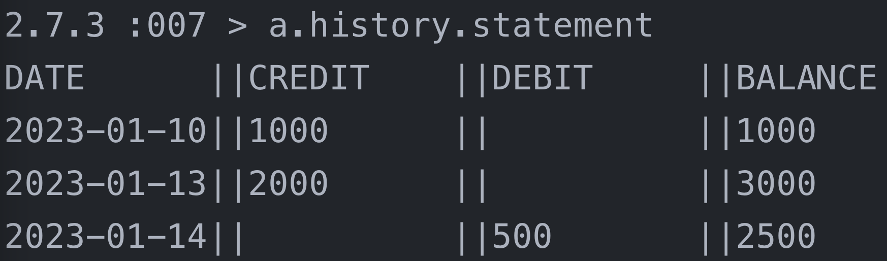

<div align="center">

# Bank Tech Test

</div>

## Install
Clone the repository
``` bash
% git clone https://github.com/arthurfincham/bank-tech-test-ruby
```
Go to the project directory and install dependencies:
```bash
% cd bank-tech-test-ruby
```
Install dependencies
``` bash
% bundle install
```
Run the test suite!
```bash
% rspec
```

## Program

This program has three classes: Account, TransactionHistory and Transcation. The program creates a new bank account and then tracks deposits and withdrawals which can be previewed by printing a bank statement:



## Assignment

* You should be able to interact with your code via a REPL like IRB or the JavaScript console. (You don't need to implement a command line interface that takes input from STDIN.)
* Deposits, withdrawal.
* Account statement (date, amount, balance) printing.
* Data can be kept in memory (it doesn't need to be stored to a database or anything).
#### Acceptance criteria
Given a client makes a deposit of 1000 on 10-01-2023
And a deposit of 2000 on 13-01-2023
And a withdrawal of 500 on 14-01-2023
When she prints her bank statement
Then she would see
```
date || credit || debit || balance
14/01/2023 || || 500.00 || 2500.00
13/01/2023 || 2000.00 || || 3000.00
10/01/2023 || 1000.00 || || 1000.00
```